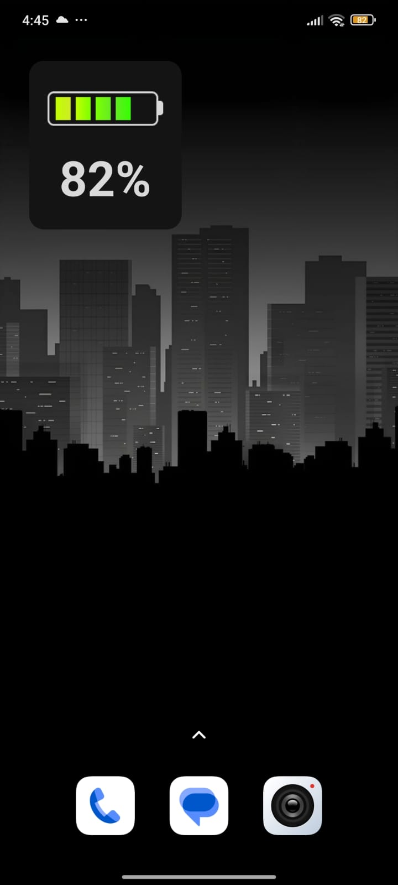

# BatteryWidget

**BatteryWidget** is an Android application that provides a simple, clear, and accessible battery widget.
It is designed especially for people with low vision who need a **large, easy-to-read battery indicator**.

The app itself is invisible — there is no launcher icon or visible interface. Users only interact with the widget.

## Features

* **Widget only** – no distracting app UI.
* **Big battery icon** with a clear percentage number.
* **Accessibility first** – designed for people who don’t see well.
* Built with **XML layouts** and **Kotlin** for simplicity and performance.

## ⚠️ Important Note

Due to Android system restrictions to preserve battery life, the widget will update automatically approximately every **30 minutes** when the device is idle.
You can always **tap the widget** to force an immediate manual update and see the current battery level.

## How to Use

1. Go to the project repository: [BatteryWidget on GitHub](https://github.com/The-uncanny-valley/BatteryWidget).
2. Download and install the latest APK from the **Releases** section (or build it yourself from source).
3. On your device, long press on the home screen → **Add Widget**.
4. Find **BatteryWidget** in the list and place it on your home screen.
5. The widget will immediately display your battery level with large, readable text.

## Tech stach
* Language: **Kotlin**
* UI: **XML layouts**
* Type: **AppWidget (homescreen widget)**
* No background services or unnecessary permissions.

## Screenshots

## License

This project is licensed under the MIT License.
